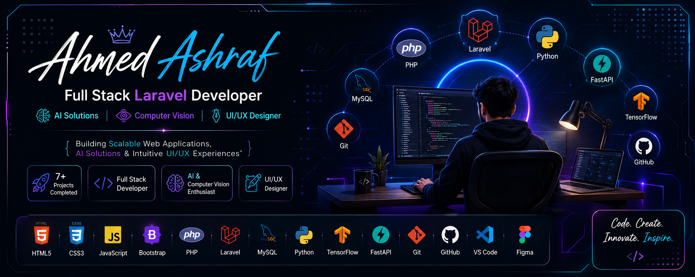

<h1 align="center">
  Hi 👋 I'm Ahmed Ashraf
</h1>

<h3 align="center">
  🚀 Full Stack Laravel Developer • AI Enthusiast • UI/UX Designer
</h3>

  

  

  

  

  

  

# 💫 About Me

💻 Full Stack Laravel Developer

🤖 Passionate about Artificial Intelligence & Computer Vision

🎨 UI/UX Designer who loves building modern interfaces

📚 Currently improving Backend Architecture & AI Systems

🚀 I enjoy turning ideas into real-world applications.

---

# 🌐 Portfolio

🌍 https://ahmed-ashraf-protoflio.vercel.app/

---

# 📫 Contact

📧 ghgdy705@gmail.com

💼 LinkedIn

https://www.linkedin.com/in/ahmed-ashraf-5a2358310/

---

# 🚀 Featured Projects

| Project | Description |
|---------|-------------|
| 🚑 Monqth Emergency System | Smart Emergency Response Platform |
| 🤖 DisasterVision-AI | AI Disaster Classification API |
| 🏪 Dynamic Store Management | Inventory & Employee Management |
| 📝 Laravel Blog CMS | Complete Blog Management System |
| 💹 CryptoLab | Modern Cryptography Toolkit |
| ✈️ Travel Modern | Responsive Travel Website |
| 🍽️ Restaurant Modern | Responsive Restaurant Website |

---

# 💻 Tech Stack

---

# 📊 GitHub Stats

---

# 🔥 GitHub Streak

---

# 🌱 Currently Learning

- Advanced Laravel
- AI & Machine Learning
- FastAPI
- Software Architecture
- Clean Code

---

# 🏆 Achievements

✔️ Built 7+ Complete Projects

✔️ Full Stack Laravel Developer

✔️ AI & Computer Vision Projects

✔️ Responsive Web Applications

✔️ REST APIs

---

# 📈 Profile Views

---

# ⭐ Support

If you like my work, consider giving a ⭐ to my repositories.

---

<h3 align="center">
Thanks for visiting ❤️
</h3>

